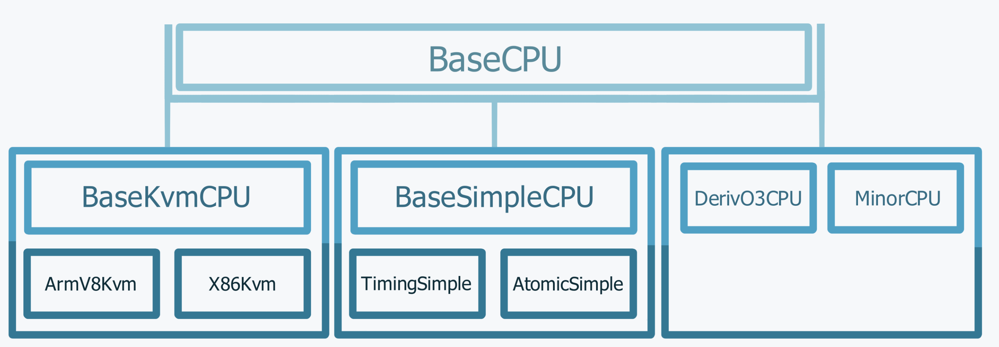
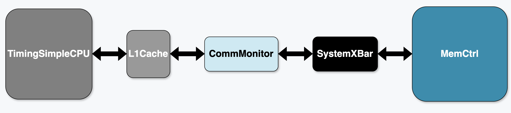

## m5ops
m5指令码用于模拟工作负载和模拟器之间进行通信，最主要的op有：
- exit [delay]: 退出模拟器，[delay] 为退出延迟，单位为cycles，默认为0。
- workbegin: 工作负载开始，通常在模拟器启动时调用。
- workend: 工作负载结束，通常在模拟器结束时调用。
- checkpoint [delay [period]]: 检查点，[delay] 为检查点延迟，单位为cycles，[period] 为检查点周期，单位为cycles，默认为0。


m5ops 主要有两个作用：标注工作负载和在磁盘映像中调用 gem5-bridge

### 在 workload 中使用 m5ops

1. 编译 m5ops library
首先我们要进入 [gem5/util/m5](https://github.com/gem5/gem5/tree/stable/util/m5) 目录,运行 `scons [{TARGET_ISA}.CROSS_COMPILE={TARGET_ISA CROSS COMPILER}] build/{TARGET_ISA}/out/m5` 来编译 m5ops library。
编译出的 `m5`用于命令行，`libm5.a`用于C/C++链接（在C++里使用头文件`<gem5/m5ops.h>`，在GCC编译选项中加上`-Igem5/include` `-Lgem5/util/m5/build/{TARGET_ISA}/out` `-lm5` ）


gem5 的标准库对于部分m5ops有默认行为。例如，当标准库的 Simulator 遇到 m5_work_begin 时，它默认会自动执行 m5.stats.reset()。

这样做的目的是为了清零统计数据，确保性能测量只针对 m5_work_begin 和 m5_work_end 之间的“感兴趣区域”（ROI）。如果想修改这个行为，可以使用 on_exit_event 参数来覆盖它。

## Synthetic Traffic Generation
合成流量组件是一个用于生成合成流量的工具，主要用来模拟内存访问，而绕过cpu的模拟。主要分为LinearGenerator/RandomGenerator(都来自于 AbstractGenerator，在 [gem5/src/python/gem5/components/processors](https://github.com/gem5/gem5/tree/stable/src/python/gem5/components/processors)可以看到所有Generator的实现)，有以下几个参数：
- num_cores: 核心数
- duration: 持续时间
- rate: 内存请求的最大速率
- block_size: 每次访问读写的字节大小
- min_addr/max_addr: 内存地址范围
- rd_perc： 读请求的比例
- data_limit： 数据量限制，如果写0就是无限制

### 创建自己的 Generator

实用函数：`partition_range()`，将一个范围划分为多个子范围，数量为num_partitions

所有的操作都是由 `XXXXCores` 类来完成的，这个类是 Generator 的子类，主要负责生成流量。

我们可以定义自己的 Generator 类，继承自 `AbstractGenerator` 类,在 super().__init__() 中我们需要传递一个列表，这个列表是使用的各个核心。

## Cores
CPU 核的模拟是 gem5 的核心功能，其部分分类如下图所示：


### SimpleCPU

- Atomic：用于预热和快速前进，忽略访存延迟
- Functional： 有后门访问内存，加载执行二进制文件
- Timing： 模拟时序，模拟时钟和时钟周期

### O3CPU
乱序执行的CPU，模拟了分支预测，缓存，内存访问等。
RiscvO3CPU(from m5.objects import RiscvO3CPU)内部有以下几个参数：
- width：fecth、decode、rename、dispatch、execute、writeback、commit 的宽度
- rob_size：重排序缓冲区的大小
- num_int_regs：整数寄存器数
- num_fp_regs：浮点寄存器数

### Statistics 阅读

- simOps: 模拟操作数，即模拟器执行的指令数
- numCycles: 模拟器执行的时钟周期数
- simSeconds: 模拟器执行的时间，单位为秒(cpu的时间)
- hostSeconds: 主机执行的时间，单位为秒(host的时间)

### 自定义 CPU 

这是一个非常好的总结思路。基于您提供的代码，这里为您提炼了一个通用的、分层封装的 gem5 CPU 自定义方法，非常适合放入您的笔记中。

-----

### **通用的 gem5 CPU 自定义方法 (分层封装)**

在 gem5 中，自定义 CPU 的最佳实践是采用“分层封装”的设计模式。这种方法将 gem5 底层的复杂模拟对象（SimObject）逐步抽象为高层的、易于使用的“组件”（Component）。

这个流程可以分为四个主要层次：

层次 1：定义“CPU 核心” (Core)

  * **目的：** 封装 gem5 底层的 SimObject，将“高级”参数映射到“低级”参数。
  * **做法：**
    1.  创建一个类（例如 `MyO3Core`），它继承自 gem5 底层的 CPU 模型（例如 `RiscvO3CPU` 或 `X86O3CPU`）。
    2.  在 `__init__` 中接收高级参数（如 `width`）。
    3.  将这些高级参数赋值给底层 SimObject 的具体参数（如 `self.fetchWidth = width`, `self.decodeWidth = width` 等）。


```python
# 层次 1：定义核心引擎
from m5.objects import RiscvO3CPU
class MyO3Core(RiscvO3CPU):
    def __init__(self, width, rob_size):
        super().__init__()
        self.fetchWidth = width
        self.decodeWidth = width
        self.commitWidth = width
        self.numROBEntries = rob_size
        # ... 设置分支预测器等
```

层次 2：定义“标准核心” (StdCore)

  * **目的：** 将“核心”注册为 gem5 标准库组件，并指定其指令集（ISA）。
  * **做法：**
    1.  创建一个类（例如 `MyO3StdCore`），它继承自 `BaseCPUCore`。
    2.  在 `__init__` 中，实例化第 1 层的“核心”（`MyO3Core`）。
    3.  调用父类 `super().__init__`，传入实例化的核心和对应的 `ISA`（例如 `ISA.RISCV`）。

```python
# 层次 2：将核心组件化并指定ISA
from gem5.isas import ISA
from gem5.components.processors.base_cpu_core import BaseCPUCore
class MyO3StdCore(BaseCPUCore):
    def __init__(self, width, rob_size):
        # 实例化第1层的核心
        core = MyO3Core(width, rob_size)
        # 注册为标准组件，并指定ISA
        super().__init__(core, ISA.RISCV)
```

层次 3：定义“处理器” (Processor)

  * **目的：** 将“核心”组装成一个完整的“处理器”，并定义它是单核还是多核。
  * **做法：**
    1.  创建一个类（例如 `MyO3Processor`），它继承自 `BaseCPUProcessor`。
    2.  在 `__init__` 中，创建一个包含一个或多个“标准核心”（来自第 2 层）的列表。
    3.  调用父类 `super().__init__`，传入这个 `cores` 列表。

```python
# 层次 3：定义处理器（单核或多核）
from gem5.components.processors.base_cpu_processor import BaseCPUProcessor
class MyO3Processor(BaseCPUProcessor):
    def __init__(self, width, rob_size):
        # 实例化第2层的核心，并放入列表
        cores = [MyO3StdCore(width, rob_size)]
        # 注册为处理器
        super().__init__(cores)
        # (可选) 在这里保存参数，用于后续分析
        self._width = width 
```
层次 4：创建“具体配置” (Configuration)

  * **目的：** 提供最终的、易于调用的“产品”类，固化所有配置参数。
  * **做法：**
    1.  创建一个类（例如 `MyBigCPU` 或 `MySmallCPU`），它继承自第 3 层的“处理器”。
    2.  在 `__init__` 中，调用父类 `super().__init__`，并传入所有**具体的配置数值**。

```python
# 层次 4：定义最终的“产品型号”
class MyBigCPU(MyO3Processor):
    def __init__(self):
        super().__init__(
            width=10,
            rob_size=40,
            # ... 其他具体参数
        )

class MySmallCPU(MyO3Processor):
    def __init__(self):
        super().__init__(
            width=2,
            rob_size=30,
            # ... 其他具体参数
        )
```

## Cache Hierarchy
主要有两种缓存层次结构：
- Classic Cache： 简单快速，灵活性不足
- Ruby: 灵活性高，包含多种缓存一致性

## memory system
标准库将 DRAM 等内存模型封装为 `MemorySystem`，有一些已经实现的例子：`muti_channel`、`single_channel`

### 添加新的内存
想要添加新的内存模型，需要保证在[gem5/components/memory/dram_interfaces](https://github.com/gem5/gem5/tree/stable/src/python/gem5/components/memory/dram_interfaces)中有一个对应的实现,然后导入它。
假设我们需要单通道lpddr2，通常写法为：
```python
from typing import Optional

from gem5.components.memory.abstract_memory_system import AbstractMemorySystem
from gem5.components.memory.dram_interfaces.lpddr2 import LPDDR2_S4_1066_1x32
from gem5.components.memory.memory import ChanneledMemory


def SingleChannelLPDDR2(
    size: Optional[str] = None,
) -> AbstractMemorySystem:
    return ChanneledMemory(LPDDR2_S4_1066_1x32, 1, 64, size=size)
```

### CommMonitor
可以监控两个端口之间的通信，对时间没有影响。如下图所示：



## 全系统仿真
全系统仿真需要提供一个包含操作系统以及任何必要软件或数据的磁盘镜像以及与模拟架构兼容的内核二进制文件来启动操作系统。